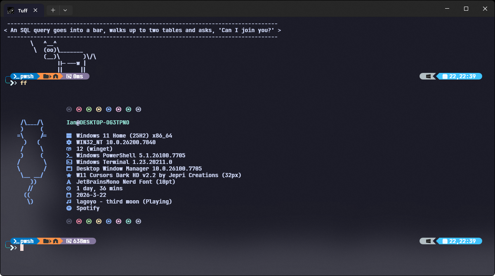

## Hi there 👋 I'm Ian (also named as o6md, bk5x)

### 📊 Stats

---

## I Use Windows BTW

### 🔥 Recent Activity

- [thedogecraft/sparkle](https://github.com/thedogecraft/sparkle) - last activity: 2026-05-03
- [heygen-com/hyperframes](https://github.com/heygen-com/hyperframes) - last activity: 2026-05-02
- [Ian-bug/ruin-injector-website](https://github.com/Ian-bug/ruin-injector-website) - last activity: 2026-05-02
- [nexu-io/open-design](https://github.com/nexu-io/open-design) - last activity: 2026-05-01
- [Aspectise/Username-Finder](https://github.com/Aspectise/Username-Finder) - last activity: 2026-04-28

### 🚀 Pinned Repositories

- [ruin-injector](https://github.com/Ian-bug/ruin-injector) - A modern DLL injector built with Rust and egui, supporting both regular and UWP processes
  - ⭐ 2 stars | 🍴 0 forks | 🔷 Rust
- [RainingKeysPython](https://github.com/Ian-bug/RainingKeysPython) - Standalone "Rain" style input visualizer for rhythm games. External, safe, and transparent.
  - ⭐ 1 stars | 🍴 0 forks | 🔷 Python
- [WhatIsBroDoing](https://github.com/Ian-bug/WhatIsBroDoing) - A Discord Rich Presence tool — displays your currently active program on Discord with customizable text and app name mapping
  - ⭐ 0 stars | 🍴 1 forks | 🔷 Python
- [ruin-injector-website](https://github.com/Ian-bug/ruin-injector-website) - Modern landing website for Ruin DLL Injector - A lightweight Windows DLL injection tool built with Rust and egui
  - ⭐ 0 stars | 🍴 0 forks | 🔷 TypeScript
- [6-7-skill](https://github.com/Ian-bug/6-7-skill) - agent skill that reacts when 67 is mentioned. 
  - ⭐ 2 stars | 🍴 0 forks | 🔷 Unknown
- [ScreenshotStretchTo16by9](https://github.com/Ian-bug/ScreenshotStretchTo16by9) - Lightweight Windows system-tray app that auto-stretches clipboard screenshots to 16:9 aspect ratio. Take a screenshot, paste — it's already 16:9.
  - ⭐ 0 stars | 🍴 0 forks | 🔷 Python

### 🤝 Connect with Me

- 💼 GitHub: [Ian-bug](https://github.com/Ian-bug)

### 📈 GitHub Overview
- 📦 Total Repositories: 13
- 👥 Followers: 4
- 🤝 Following: 5

---
✨ Last updated: 2026-05-04 08:39:32 UTC

<!--
**Ian-bug/Ian-bug** is a ✨ _special_ ✨ repository because its
`README.md` (this file) appears on your GitHub profile.

Here are some ideas to get you started:

- 🔭 I'm currently working on ...
- 🌱 I'm currently learning ...
- 👯 I'm looking to collaborate on ...
- 🤔 I'm looking for help with ...
- 💬 Ask me about ...
- 📫 How to reach me: ...
- 😄 Pronouns: ...
- ⚡ Fun fact: ...
-->
